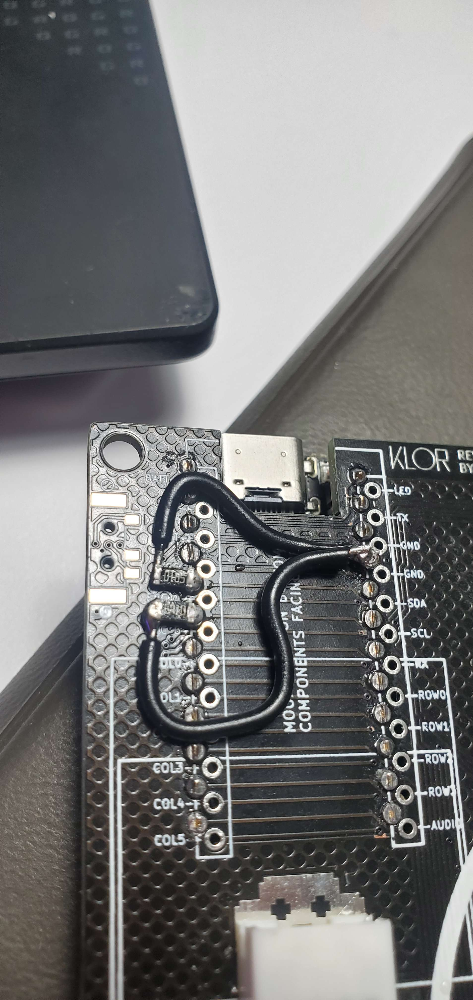

My repo is modified to use the Blok MCU. I reccomend using the main branch for QMK config if you are using a more common MCU.
I used a Cirque 35mm trackpad [You can get from Mouser in the USA](https://www.mouser.com/ProductDetail/Cirque/TM035035-2024-003?qs=wd5RIQLrsJiMSFF94ofOQw%3D%3D). You will need to either have [pull up resistors](https://rheingoldheavy.com/i2c-pull-resistors/) or solder a 5.1k resistor between VCC/GND and the SDA/SDL pins on your MCU like below. Your pins layout will likely be different:

Here are the acrylic parts:

